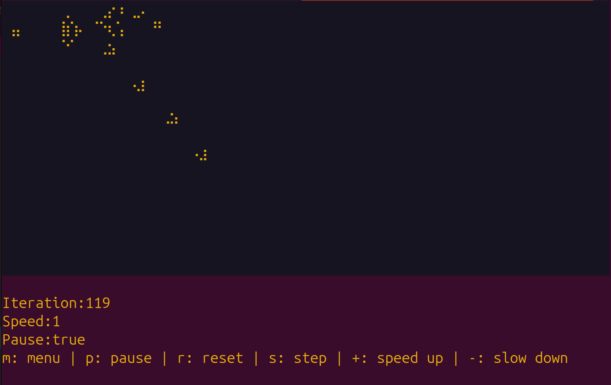

# Rust Game of life

A rust based implementation of Conway's Game of Life.

### Launching the program

With docker:
```bash
docker build -t life . && docker run -it --rm life
```

With just a rust installation:
```bash
cargo run
```

It uses braille and some character arithmetics to draw alive cells.



| Code   | 0   | 1   | 2   | 3   | 4   | 5   | 6   | 7   | 8   | 9   | A   | B   | C   | D   | E   | F   |
|--------|-----|-----|-----|-----|-----|-----|-----|-----|-----|-----|-----|-----|-----|-----|-----|-----|
| U+280x | ⠀  | ⠁  | ⠂  | ⠃  | ⠄  | ⠅  | ⠆  | ⠇  | ⠈  | ⠉  | ⠊  | ⠋  | ⠌  | ⠍  | ⠎  | ⠏  |
| U+281x | ⠐  | ⠑  | ⠒  | ⠓  | ⠔  | ⠕  | ⠖  | ⠗  | ⠘  | ⠙  | ⠚  | ⠛  | ⠜  | ⠝  | ⠞  | ⠟  |
| U+282x | ⠠  | ⠡  | ⠢  | ⠣  | ⠤  | ⠥  | ⠦  | ⠧  | ⠨  | ⠩  | ⠪  | ⠫  | ⠬  | ⠭  | ⠮  | ⠯  |
| U+283x | ⠰  | ⠱  | ⠲  | ⠳  | ⠴  | ⠵  | ⠶  | ⠷  | ⠸  | ⠹  | ⠺  | ⠻  | ⠼  | ⠽  | ⠾  | ⠿  |
| U+284x | ⡀  | ⡁  | ⡂  | ⡃  | ⡄  | ⡅  | ⡆  | ⡇  | ⡈  | ⡉  | ⡊  | ⡋  | ⡌  | ⡍  | ⡎  | ⡏  |
| U+285x | ⡐  | ⡑  | ⡒  | ⡓  | ⡔  | ⡕  | ⡖  | ⡗  | ⡘  | ⡙  | ⡚  | ⡛  | ⡜  | ⡝  | ⡞  | ⡟  |
| U+286x | ⡠  | ⡡  | ⡢  | ⡣  | ⡤  | ⡥  | ⡦  | ⡧  | ⡨  | ⡩  | ⡪  | ⡫  | ⡬  | ⡭  | ⡮  | ⡯  |
| U+287x | ⡰  | ⡱  | ⡲  | ⡳  | ⡴  | ⡵  | ⡶  | ⡷  | ⡸  | ⡹  | ⡺  | ⡻  | ⡼  | ⡽  | ⡾  | ⡿  |
| U+288x | ⢀  | ⢁  | ⢂  | ⢃  | ⢄  | ⢅  | ⢆  | ⢇  | ⢈  | ⢉  | ⢊  | ⢋  | ⢌  | ⢍  | ⢎  | ⢏  |
| U+289x | ⢐  | ⢑  | ⢒  | ⢓  | ⢔  | ⢕  | ⢖  | ⢗  | ⢘  | ⢙  | ⢚  | ⢛  | ⢜  | ⢝  | ⢞  | ⢟  |
| U+28Ax | ⢠  | ⢡  | ⢢  | ⢣  | ⢤  | ⢥  | ⢦  | ⢧  | ⢨  | ⢩  | ⢪  | ⢫  | ⢬  | ⢭  | ⢮  | ⢯  |
| U+28Bx | ⢰  | ⢱  | ⢲  | ⢳  | ⢴  | ⢵  | ⢶  | ⢷  | ⢸  | ⢹  | ⢺  | ⢻  | ⢼  | ⢽  | ⢾  | ⢿  |
| U+28Cx | ⣀  | ⣁  | ⣂  | ⣃  | ⣄  | ⣅  | ⣆  | ⣇  | ⣈  | ⣉  | ⣊  | ⣋  | ⣌  | ⣍  | ⣎  | ⣏  |
| U+28Dx | ⣐  | ⣑  | ⣒  | ⣓  | ⣔  | ⣕  | ⣖  | ⣗  | ⣘  | ⣙  | ⣚  | ⣛  | ⣜  | ⣝  | ⣞  | ⣟  |
| U+28Ex | ⣠  | ⣡  | ⣢  | ⣣  | ⣤  | ⣥  | ⣦  | ⣧  | ⣨  | ⣩  | ⣪  | ⣫  | ⣬  | ⣭  | ⣮  | ⣯  |
| U+28Fx | ⣰  | ⣱  | ⣲  | ⣳  | ⣴  | ⣵  | ⣶  | ⣷  | ⣸  | ⣹  | ⣺  | ⣻  | ⣼  | ⣽  | ⣾  | ⣿  |